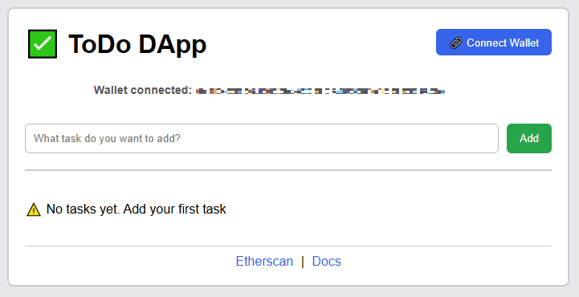
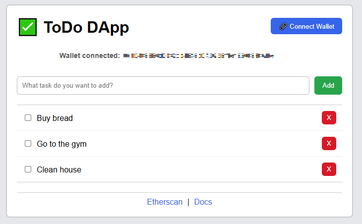

# Decentralized To-Do List (Web3 dApp)

This is a decentralized To-Do List application built as a learning project for Web3 and blockchain development.

## 🚀 Tech Stack

- **Smart Contracts:** Solidity + Hardhat
- **Frontend:** React/Next.js + Tailwind
- **Blockchain:** Ethereum testnet (Sepolia)

## 📑 Features

- Add new tasks stored on-chain
- Mark tasks as completed
- Retrieve tasks linked to the connected wallet
- Delete tasks from the list

## 📂 Project Structure

- contracts/ # Solidity smart contracts
- frontend/ # Next.js/React frontend
- scripts/ # Deployment and interaction scripts
- test/ # Smart contract tests

## 📌 Roadmap

- [x] Write and test smart contract
- [x] Deploy to Sepolia testnet
- [x] Connect frontend to contract
- [x] Improve UI/UX and add wallet integration
- [ ] (Optional) Add backend/indexer for scalability

## 📸 Screenshots

### Main View



### List View



## ⚡ Quick Start (Run Locally)

1. **Clone the repository**

```bash
git clone <repo-url>
cd todo-dapp
```

2. **Install dependencies**

```bash
npm install
```

3. **Compile smart contract**

```bash
npx hardhat compile
```

4. **Run tests**

```bash
npx hardhat test
```

5. **Run frontend**

```bash
cd frontend
npm run dev
```

6. **Open your browser**

```bash
Visit http://localhost:3000 and connect your wallet (MetaMask).
Make sure your wallet is connected to the Sepolia testnet.
```
